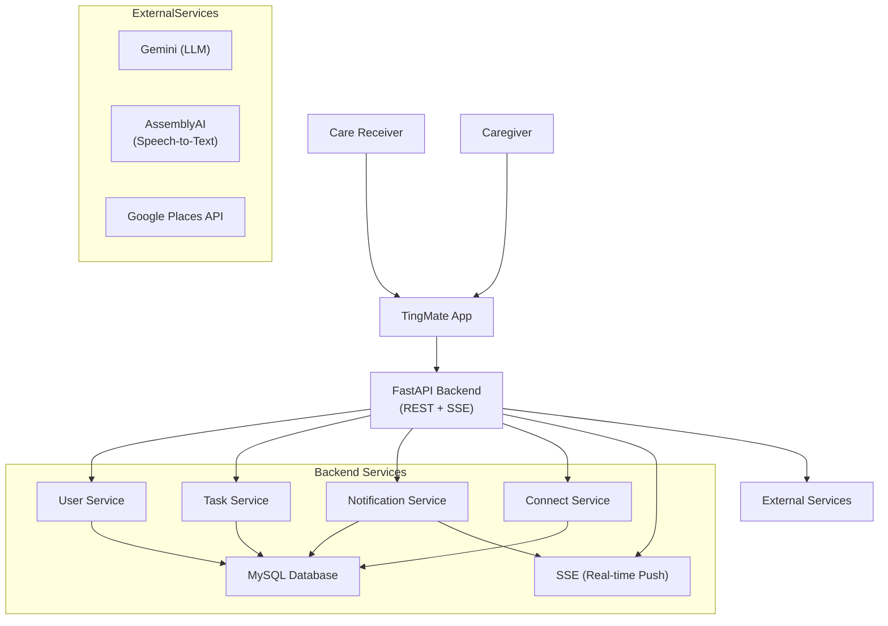

# TingMate Backend

<p align="center">
  
</p>

<!-- TODO: Add architecture diagram (optional) -->

**Ting Mate** is a mobile app designed to assist memory-impaired individuals and their caregivers with daily task management, reminders, and collaborative features. While the frontend focuses on an accessible interface and voice interaction, the backend powers the system through APIs, logic, and data services.

This repository contains the backend implementation, built with **Python** and **FastAPI**.

To view the app’s user interface and interaction design, see the [Ting Mate Frontend](https://vivi2393142.github.io/ting-mate-backend/) repository.

## Core Services and Capabilities

The backend exposes a range of APIs and services that support app functionality, including voice processing, task scheduling, real-time caregiver interaction, and geolocation.



### Task Management API

- CRUD operations for user tasks
- Support for recurrence rules and reminders
- Status tracking and update timestamps

### Voice Assistant Integration

- Accepts transcribed user input (from frontend)
- Uses **Google Gemini** to parse intent and extract structured task commands
- Returns actions such as `create`, `edit`, `complete`, or `query` with high reliability

### Speech-to-Text Handling

- Receives audio blobs from frontend
- Sends to **AssemblyAI** for transcription
- Returns clean text for LLM processing

### Safe Zone and Location Tracking

- Stores user-defined safe zones (address + radius)
- Handles location logs and triggers for out-of-zone detection
- Supports future caregiver alerts

### Account and Session Management

- Supports anonymous usage (UUID-based) with option to upgrade to registered accounts
- Manages linked caregiver pairs for data sharing
- Handles onboarding logic and user settings

### Notification Triggering

- Triggers **local push notifications** via task logic and scheduling
- Supports **real-time caregiver-triggered events** via **SSE (Server-Sent Events)**

## Technologies & Services

- **FastAPI** – Web API framework
- **MySQL** – Main database
- **Google Gemini** – LLM-powered task intent parser
- **AssemblyAI** – Audio-to-text transcription
- **Server-Sent Events (SSE)** – Real-time event pushing to frontend
- **Pydantic** – Validation and data modeling
- **Uvicorn** – ASGI server

## Project Structure

```
app/
├─ api/           # Route definitions
├─ core/          # Config, env, and shared helpers
├─ db/            # DB setup and connection logic
├─ repositories/  # SQL queries and data access
├─ schemas/       # Pydantic models
├─ services/      # Business logic (LLM, voice, user, etc.)
├─ main.py        # App entrypoint
scripts/          # CLI tools for DB and dev setup
tests/            # Pytest test cases
```

## Setup and Development

### 1. Create a Virtual Environment

```bash
python3 -m venv .venv
source .venv/bin/activate
```

### 2. Install Dependencies

```bash
make sync-all  # Includes dev dependencies
```

### 3. Configure Environment

Create a `.env` file in the project root with the following:

```env
ASSEMBLYAI_API_KEY=...
GEMINI_API_KEY=...
GEMINI_MODEL_NAME=...
DB_HOST=localhost
DB_USER=root
DB_PASSWORD=your_password
DB_NAME=tingmate
```

### 4. Initialize the Database

```bash
make init-db
```

### 5. Run the Server

```bash
make server
```

### 6. Run Tests

```bash
make test
# or
pytest
```

## Future Work

<!-- TODO -->

- Add authentication/authorization layer (OAuth2 or JWT)
- Optimize database indexes for large caregiver networks
- Add audit logs and caregiver alerting
- Support fallback models for LLM or on-device parsing
