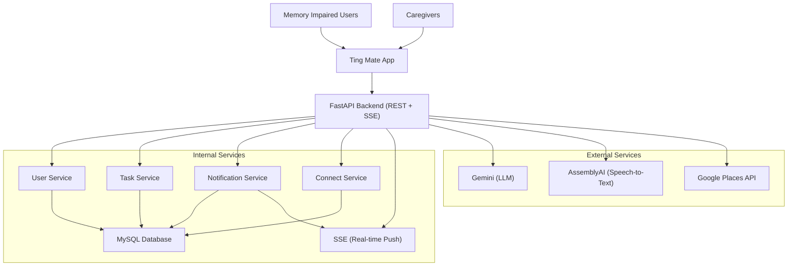
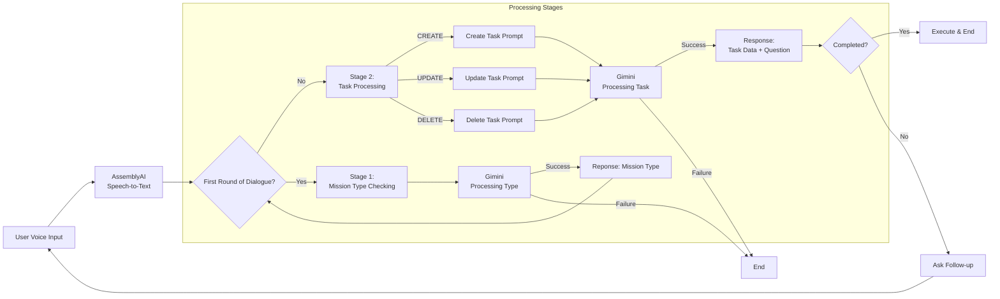

# Ting Mate Backend

<p align="center">
  
</p>

**Ting Mate** is a mobile app designed to assist memory-impaired individuals and their caregivers with daily task management, reminders, and collaborative features. While the frontend focuses on an accessible interface and voice interaction, the backend powers the system through APIs, business logic, and data services.

This repository contains the backend implementation, built with **Python** and **FastAPI**.

To view the app’s UI and interaction design, see the **[Ting Mate Frontend](https://vivi2393142.github.io/ting-mate-frontend/)** repository.

## Core Services and Capabilities

The backend exposes APIs and services that support app functionality, including voice processing, task scheduling, real-time caregiver interaction, and geolocation.

### System Architecture



### Task Management API

- CRUD operations for user tasks
- Support for recurrence rules and reminders
- Status tracking with timestamps

### Voice Assistant Integration



- Endpoints:

  - `/assistant/command`: intent detection + slot filling
  - `/assistant/execute_pending_task`: executes confirmed task from prior step

- Supports **multi-turn flow** with `conversation_id` and `previous_response`
- Uses **Google Gemini** to parse structured task commands

### Safe Zone and Location Tracking

- Stores user-defined safe zones (address + radius)
- Location synced every 10 minutes (foreground only)
- Out-of-zone triggers planned with push notifications

### Account and Session Management

- Anonymous usage (UUID-based), upgradable to registered accounts
- Data migrates automatically after login
- Linked caregiver pairs for shared data access
- Role-based logic: care receiver by default, caregiver requires login

### Notification Triggering

- **Local scheduled notifications**: reminders & missed tasks
- **SSE events**: real-time caregiver updates while app is open
- **Push notifications**: planned for background alerts

## Technologies & Services

- **FastAPI** – Web API framework
- **MySQL** – Main database
- **Google Gemini** – LLM-powered intent parsing
- **AssemblyAI** – Audio-to-text transcription
- **Server-Sent Events (SSE)** – Real-time event push
- **Pydantic** – Validation & data modeling
- **Uvicorn** – ASGI server

## Project Structure

```
app/
  ├─ api/           # Route definitions
  ├─ core/          # Config, env, and shared helpers
  ├─ db/            # DB setup and connection logic
  ├─ repositories/  # SQL queries and data access
  ├─ schemas/       # Pydantic models
  ├─ services/      # Business logic (LLM, voice, user, etc.)
  ├─ main.py        # App entrypoint
scripts/          # CLI tools for DB and dev setup
tests/            # Pytest test cases
```

## Setup and Development

### 1. Create a Virtual Environment

```bash
python3 -m venv .venv
source .venv/bin/activate
```

### 2. Install Dependencies

```bash
make sync-all
```

### 3. Configure Environment

Create `.env` in project root:

```env
ASSEMBLYAI_API_KEY=...
GEMINI_API_KEY=...
GEMINI_MODEL_NAME=...
DB_HOST=localhost
DB_USER=root
DB_PASSWORD=your_password
DB_NAME=tingmate
JWT_SECRET_KEY=...
JWT_ALGORITHM=HS256
```

### 4. Initialize the Database

```bash
make init-db
```

### 5. Run the Server

```bash
make server
```

### 6. Run Tests

```bash
make test
# or
pytest
```

## API Overview

| Category      | Endpoint                          | Description                            |
| ------------- | --------------------------------- | -------------------------------------- |
| Tasks         | `/tasks` (CRUD)                   | Manage tasks and reminders             |
| Assistant     | `/assistant/command`              | Parse intent, slot filling             |
|               | `/assistant/execute_pending_task` | Execute confirmed task                 |
| Users/Auth    | `/auth/login`, `/auth/register`   | JWT auth, supports anonymous upgrade   |
| Connect       | `/connect`                        | Safe zone, contacts, shared notes/logs |
| Notifications | `/sse`                            | Real-time caregiver updates            |

## Future Work

- **Background Functionality**

  - Enable background location tracking
  - Implement push notifications for closed-app caregiver alerts

- **Voice Assistant Enhancements**

  - Improve accuracy for task-related commands
  - Support casual conversations and non-task queries
  - Integrate iOS built-in speech-to-text

- **Account Linking**

  - QR code–based linking for easier setup

- **Accessibility & Internationalization**

  - Expand accessibility profiles (large text, simple UI)
  - Add multi-language support

- **Backend Improvements**

  - Add refresh tokens for JWT auth
  - Optimize DB indexes for larger caregiver networks
  - Add audit logs and caregiver alerting
  - Explore fallback LLM models or on-device parsing
  - Strengthen privacy controls for sensitive data
